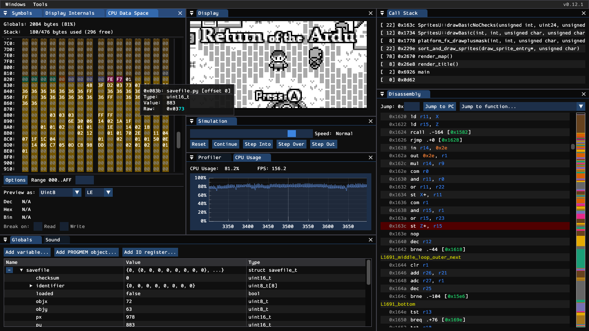

# arduboy_sim

[Arduboy](https://www.arduboy.com/) simulator for profiling and debugging.

[Try it out here.](https://tiberiusbrown.github.io/arduboy_sim/)
Drag and drop an [Arduboy game](https://community.arduboy.com/c/games/35) (.hex/.elf/.arduboy) and any FX data (.bin) onto the page. Or, try one of the game URLs below:

- [ArduChess](https://tiberiusbrown.github.io/arduboy_sim/player.html?file=https://raw.githubusercontent.com/tiberiusbrown/arduchess/master/arduchess/arduchess.hex)
- [ArduGolf](https://tiberiusbrown.github.io/arduboy_sim/player.html?file=https://raw.githubusercontent.com/tiberiusbrown/arduboy_minigolf/master/ardugolf.hex)
- [ArduRogue](https://tiberiusbrown.github.io/arduboy_sim/player.html?file=https://raw.githubusercontent.com/tiberiusbrown/ardurogue/master/ardurogue.hex)

## Libraries Used

- [SDL](https://github.com/libsdl-org/SDL) (zlib)
- [sokol](https://github.com/floooh/sokol) (zlib)
- [LLVM Project](https://github.com/llvm/llvm-project) (Apache v2.0 with LLVM Exceptions) 
- [Dear ImGui](https://github.com/ocornut/imgui) (MIT)
- [ImPlot](https://github.com/epezent/implot) (MIT)
- [imgui_markdown](https://github.com/juliettef/imgui_markdown) (zlib)
- [Simple-FFT](https://github.com/d1vanov/Simple-FFT) (MIT)
- [brunexgeek/hqx](https://github.com/brunexgeek/hqx) (Apache v2.0)
- [{fmt}](https://github.com/fmtlib/fmt) (MIT)
- [JSON for Modern C++](https://github.com/nlohmann/json) (MIT)
- [Miniz](https://github.com/richgel999/miniz) (MIT)
- [Bitsery](https://github.com/fraillt/bitsery) (MIT)
- [stb_image_write](https://github.com/nothings/stb/blob/master/stb_image_write.h) (Public Domain)
- [GIF encoder](https://github.com/lecram/gifenc) (Public Domain)
- [AudioFile](https://github.com/adamstark/AudioFile) (MIT)
- [Emscripten Browser File Library](https://github.com/Armchair-Software/emscripten-browser-file) (MIT)
