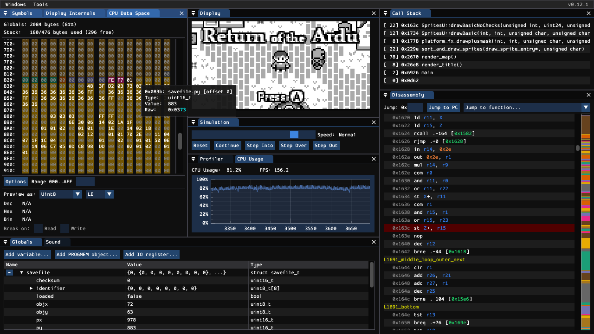

# Ardens

Ardens is an [Arduboy](https://www.arduboy.com/) simulator, player, profiler, and debugger. It runs Arduboy games on desktop and in the browser, with extra tooling for inspecting CPU state, display state, EEPROM, FX flash, serial output, sound, source symbols, and performance hotspots.



## Try It Online

- [Full debugger](https://tiberiusbrown.github.io/Ardens/)
- [Minimal player](https://tiberiusbrown.github.io/Ardens/player.html)
- [Flashcart player](https://tiberiusbrown.github.io/Ardens/flashcart.html)

Drag and drop an Arduboy game onto the page, or use a `file=` URL parameter. Supported game inputs include `.hex`, `.elf`, `.arduboy`, `.bin` FX data, and `.snapshot` files created by Ardens.

Example player links:

- [ArduChess](https://tiberiusbrown.github.io/Ardens/player.html?file=https://raw.githubusercontent.com/tiberiusbrown/arduchess/master/arduchess/arduchess.hex)
- [ArduGolf](https://tiberiusbrown.github.io/Ardens/player.html?file=https://raw.githubusercontent.com/tiberiusbrown/arduboy_minigolf/master/ardugolf.hex)
- [ArduRogue](https://tiberiusbrown.github.io/Ardens/player.html?file=https://raw.githubusercontent.com/tiberiusbrown/ardurogue/master/ardurogue.hex)

For Arduboy FX games, pass both the program and FX data:

```text
https://tiberiusbrown.github.io/Ardens/player.html?file=https://example.com/game.hex&file=https://example.com/fxdata.bin
```

## Applications

Ardens builds several related targets:

| Target | Purpose |
| --- | --- |
| `Ardens` | Full debugger, profiler, and player UI. |
| `ArdensPlayer` | Minimal player UI for running games. |
| `ArdensFlashcart` | Browser flashcart player using `src/boot/flashcart.zip`. |
| `ardens_libretro` | Libretro core for frontends such as RetroArch. |
| `integration_tests` | Test executable for emulator behavior. |
| `Ardens_benchmark` | Optional benchmark executable. |
| `Ardens_cycles` | Optional cycle-counting utility. |

## Features

- AVR/ATmega32U4 Arduboy simulation with Arduboy, Arduboy FX, FX dev kit, and Arduboy Mini FX-port modes.
- Program loading from Intel HEX, ELF, `.arduboy` packages, FX `.bin` data, and Ardens snapshots.
- Debug information support from ELF/DWARF when built with LLVM.
- Instruction-level profiler with inclusive CPU load and raw cycle count views.
- Live CPU usage graph, disassembly, source view, symbols, globals, locals, and call stack.
- RAM and register inspector with live editing, stack tracking, data breakpoints, and display-buffer visualization.
- Simulation controls for pause, continue, reset, speed control, step into/over/out, and time-travel debugging with backward stepping and a recent-history timeline.
- Runtime auto-breaks for common errors such as stack overflow, invalid memory access, invalid PC, SPI write collision, and FX busy access.
- Serial monitor, LEDs, EEPROM editor, FX data editor, save-file view, and program-memory view.
- SSD1306, SSD1309, and SH1106 display models with optional temporal filtering and row-driver current modeling.
- Display palettes, pixel grids, rotation, integer scaling, ScaleNx and HQx filters.
- Sound waveform and frequency views.
- PNG screenshots, GIF recording, optional WAV audio recording, and full-state snapshots.
- Optional linked secondary Arduboy simulation for I2C/link testing.
- Desktop, web, distributable embedded-game, and libretro builds.

## Controls

| Key | Action |
| --- | --- |
| Arrow keys | Arduboy directional buttons |
| `A` / `Z` | Arduboy A button |
| `S` / `X` / `B` | Arduboy B button |
| `F1` | Desktop debugger: screenshot entire window |
| `F2` | Save display screenshot |
| `F3` | Toggle GIF recording |
| `F4` | Debugger: save snapshot |
| `F5` | Debugger: pause or continue |
| `F8` | Reset |
| `F11` | Toggle fullscreen |
| `O` | Debugger: settings window |
| `P` | Debugger: toggle player/full-zoom mode |
| `R` | Rotate display |

## Command Line Usage

Desktop builds accept `key=value` parameters followed by one or more files:

```text
Ardens palette=highcontrast grid=normal current=true file=game.hex file=fxdata.bin
```

Any argument whose key is not a recognized parameter is treated as a file path. Use `save=path` to load a save file.

## URL and CLI Parameters

The web debugger, web player, and desktop applications share the same parameter parser. In URLs, append parameters after `?` and separate them with `&`. On desktop, pass them as command-line arguments.

| Parameter | Values |
| --- | --- |
| `file` | URL or path to a game, FX data, or snapshot. May be repeated. |
| `save` | URL or path to save data. |
| `z` | Toggle player/full-zoom mode: `0`, `1`, `false`, `true`, `off`, `on`, `no`, `yes`. |
| `g`, `grid` | Pixel grid: `none`, `normal`, `red`, `green`, `blue`, `cyan`, `magenta`, `yellow`, `white`, or numeric value. |
| `p`, `palette` | Display palette: `default`, `retro`, `lowcontrast`, `highcontrast`, or numeric value. |
| `af`, `autofilter` | Temporal display filtering for grayscale games: boolean value. |
| `f`, `filter` | Upscaling filter: `none`, `scale2x`, `scale3x`, `scale4x`, `hq2x`, `hq3x`, `hq4x`, or numeric value. |
| `ds`, `downsample` | Integer downsample ratio after filtering: `1` to `4`. |
| `ori`, `orientation` | Display rotation: `0`/`normal`, `90`/`cw`/`cw90`, `180`/`flip`, `270`/`ccw`/`ccw90`, or `0` to `3`. |
| `v`, `volume` | Audio gain from `0` to `200`; default is `100`. |
| `i`, `intscale` | Restrict display scaling to integer factors: boolean value. |
| `c`, `current` | Display current model: `0`/`off`, `1`/`subtle`, `2`/`normal`, `3`/`exaggerated`, or boolean value. |
| `fxport` | Flash select port: `0`/`d1`/`fx`, `1`/`d2`/`fxdevkit`, `2`/`e2`/`mini`. |
| `display` | Display type: `0`/`ssd1306`, `1`/`ssd1309`, `2`/`sh1106`. |
| `usb`, `usb_connected` | Emulated USB bus connection state: boolean value. |
| `touch` | Always show touch controls: boolean value. |
| `size` | Desktop only: initial window size, such as `800x400`. |

Boolean parameters accept `0`, `1`, `false`, `true`, `off`, `on`, `no`, and `yes`.

## Build From Source

Clone with submodules:

```sh
git clone --recursive https://github.com/tiberiusbrown/Ardens.git
cd Ardens
```

If the repository was already cloned, initialize submodules with:

```sh
git submodule update --init --recursive
```

Configure and build the default desktop targets:

```sh
cmake -B build -DCMAKE_BUILD_TYPE=Release
cmake --build build --config Release
```

On Windows with Visual Studio, select an architecture during configure if needed:

```sh
cmake -B build -A x64 -DCMAKE_BUILD_TYPE=Release
cmake --build build --config Release
```

The default build enables LLVM support. CMake downloads LLVM 16.0.0 through `FetchContent` so Ardens can load ELF files and debug information. To build faster without ELF/DWARF support:

```sh
cmake -B build -DCMAKE_BUILD_TYPE=Release -DARDENS_LLVM=OFF
cmake --build build --config Release
```

Linux desktop builds require the usual C++/CMake toolchain plus graphics/audio development libraries used by SDL/OpenGL. The CI installs `libpulse-dev` and `libgl1-mesa-dev`.

## CMake Options

| Option | Default | Description |
| --- | --- | --- |
| `ARDENS_LLVM` | `ON` | Build/link LLVM support for ELF and DWARF debug info. |
| `ARDENS_DEBUGGER` | `ON` | Build the full `Ardens` debugger. |
| `ARDENS_PLAYER` | `ON` | Build `ArdensPlayer`. |
| `ARDENS_FLASHCART` | `ON` | Build `ArdensFlashcart`. |
| `ARDENS_LIB` | `OFF` | Build the emulator core static library. |
| `ARDENS_LIBRETRO` | `OFF` | Build the libretro core. Disables desktop app targets and LLVM. |
| `ARDENS_DIST` | `OFF` | Build standalone distributable players from `dist/*.arduboy`. |
| `ARDENS_BENCHMARK` | `OFF` | Build benchmark executables. |
| `ARDENS_CYCLES` | `OFF` | Build the cycle-counting utility. |
| `ARDENS_SDL` | `ON` on desktop | Use the SDL backend. |
| `ARDENS_WEB_JS` | `OFF` on Emscripten | Build JavaScript-only output instead of WebAssembly. |

## Tests and Benchmarks

Build and run the integration tests:

```sh
cmake -B build-tests -DCMAKE_BUILD_TYPE=Release -DARDENS_LLVM=OFF -DARDENS_DEBUGGER=OFF -DARDENS_PLAYER=OFF -DARDENS_LIBRETRO=OFF
cmake --build build-tests --config Release --target integration_tests
./build-tests/integration_tests
```

On Windows, the executable is usually under the configuration directory:

```powershell
.\build-tests\Release\integration_tests.exe
```

Optional benchmark targets:

```sh
cmake -B build-bench -DCMAKE_BUILD_TYPE=Release -DARDENS_BENCHMARK=ON
cmake --build build-bench --config Release --target Ardens_benchmark Ardens_benchmark_debugger
```

## Web Builds

Web builds use Emscripten. The CI currently uses Emscripten 3.1.64 and builds both JS-only and WebAssembly packages.

Example configure command:

```sh
source /path/to/emsdk/emsdk_env.sh
emcmake cmake -B build-web -DCMAKE_BUILD_TYPE=Release -DARDENS_WEB_JS=OFF
cmake --build build-web --config Release --target Ardens ArdensPlayer ArdensFlashcart
```

When LLVM is enabled for web builds, LLVM tablegen tools must be available for the host build. See `.github/workflows/check.yml` for the exact CI sequence.

## Libretro Core

Build the libretro core with:

```sh
cmake -B build-libretro -DCMAKE_BUILD_TYPE=Release -DARDENS_LIBRETRO=ON
cmake --build build-libretro --config Release --target ardens_libretro
```

The libretro core supports `.hex` and `.arduboy` content, savestates, and no BIOS/firmware requirement. Metadata lives in `src/libretro_core/ardens_libretro.info`.

## Distributable Game Builds

Place one or more `.arduboy` packages in `dist/`, then build with `ARDENS_DIST=ON`. Each package is embedded into its own standalone player target.

```sh
cmake -B dist/build -DARDENS_LLVM=OFF -DARDENS_DEBUGGER=OFF -DARDENS_PLAYER=OFF -DARDENS_DIST=ON -DCMAKE_BUILD_TYPE=Release
cmake --build dist/build --config Release
```

Helper scripts are provided:

- `dist/build_windows.bat`
- `dist/build_macos.sh`
- `dist/build_linux.sh`

## Repository Layout

| Path | Contents |
| --- | --- |
| `src/` | Emulator core, debugger/player UI, platform backends, web HTML shells, and libretro core. |
| `src/boot/` | Embedded bootloader/menu assets and flashcart package. |
| `tests/` | Integration tests, ROM fixtures, expected serial output, and reference material. |
| `bench/` | Benchmark and cycle-counting inputs. |
| `deps/` | Third-party dependencies. Some are vendored; some are git submodules. |
| `cmake/` | CMake helpers and Linux distribution build scripts. |
| `dist/` | Standalone game distribution scripts and input `.arduboy` packages. |
| `img/` | Icons, resources, and README screenshot. |

## Dependencies

Ardens uses the following third-party libraries:

- [SDL](https://github.com/libsdl-org/SDL) - zlib
- [sokol](https://github.com/floooh/sokol) - zlib
- [LLVM Project](https://github.com/llvm/llvm-project) - Apache 2.0 with LLVM Exceptions
- [Dear ImGui](https://github.com/ocornut/imgui) - MIT
- [ImPlot](https://github.com/epezent/implot) - MIT
- [imgui_markdown](https://github.com/juliettef/imgui_markdown) - zlib
- [ImGuiColorTextEdit](https://github.com/BalazsJako/ImGuiColorTextEdit) - MIT
- [Simple-FFT](https://github.com/d1vanov/Simple-FFT) - MIT
- [brunexgeek/hqx](https://github.com/brunexgeek/hqx) - Apache 2.0
- [{fmt}](https://github.com/fmtlib/fmt) - MIT
- [RapidJSON](https://github.com/Tencent/rapidjson) - MIT
- [Miniz](https://github.com/richgel999/miniz) - MIT
- [Bitsery](https://github.com/fraillt/bitsery) - MIT
- [stb_image_write](https://github.com/nothings/stb/blob/master/stb_image_write.h) - public domain
- [gifenc](https://github.com/lecram/gifenc) - public domain
- [AudioFile](https://github.com/adamstark/AudioFile) - MIT
- [Emscripten Browser File Library](https://github.com/Armchair-Software/emscripten-browser-file) - MIT
- [Filewatch](https://github.com/ThomasMonkman/filewatch) - MIT
- [yyjson](https://github.com/ibireme/yyjson) - MIT
- [Google Benchmark](https://github.com/google/benchmark) - Apache 2.0

## License

Ardens is released under the MIT License. See [LICENSE.txt](LICENSE.txt).
